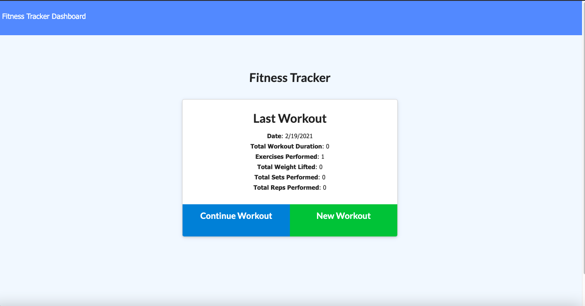
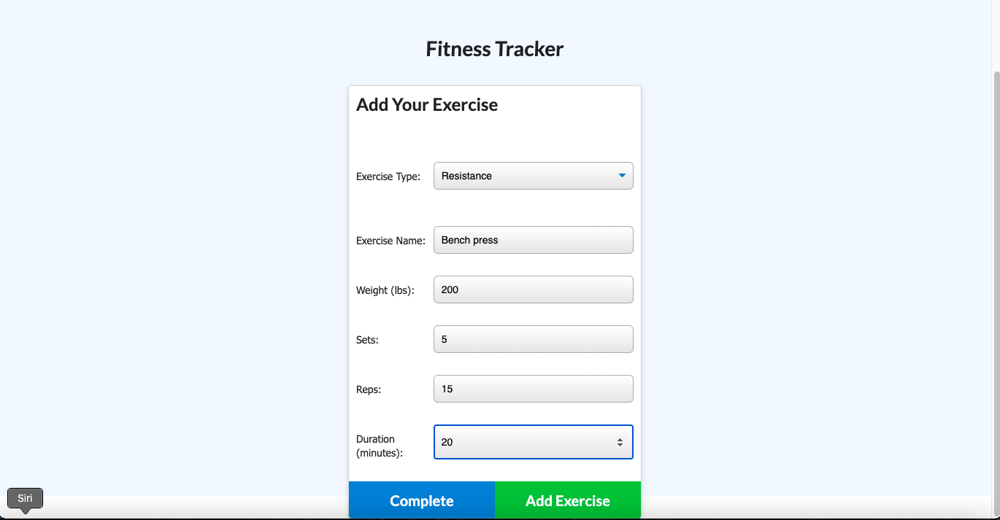
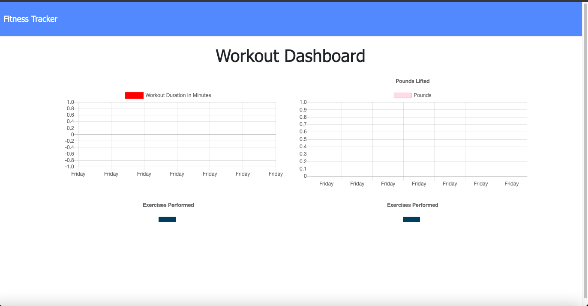

# Workout-Tracker# update-Portfolio

## Table of Contents
 - [Description](#description)

 - [Deployed Link](#deployed-link)

 - [License](#license)

 - [TechnonlogyUse](#Technonlogy-Use)

 - [Question](#Question)

## Description
This web Application allows a user to create and track a daily workout.
also the user can track the name,type,weight,duration of the exercise.

## Image

 

 

 

## Deployed Link
* [Deploy link] (https://rocky-tundra-40131.herokuapp.com/stats)

## Technonlogy Use

* MongoDb
* Mongoose Schema
* Experss
* Heroku

## License

## Question
  
 * [Email](abuye20@yahoo.com)

 * [LinkedIn](https://www.linkedin.com/in/abuye-mamuye-5a49921b0/)

 * [GitHub](https://github.com/AbuyeM1)

## Acknowledgments
 - Jerome Chenette (Instructor)
 - Manuel Nunes (TA)
 - Mahisha Manikandan (TA)
 - UC Berkeley Coding Bootcamp
